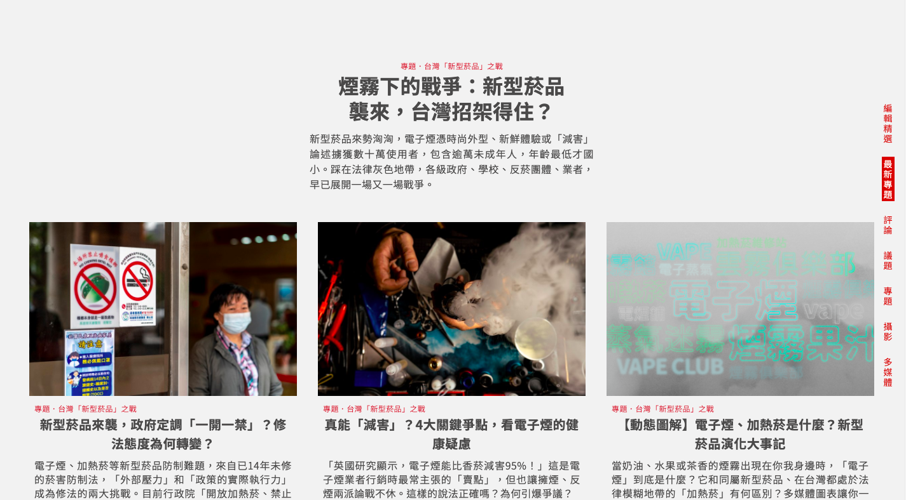
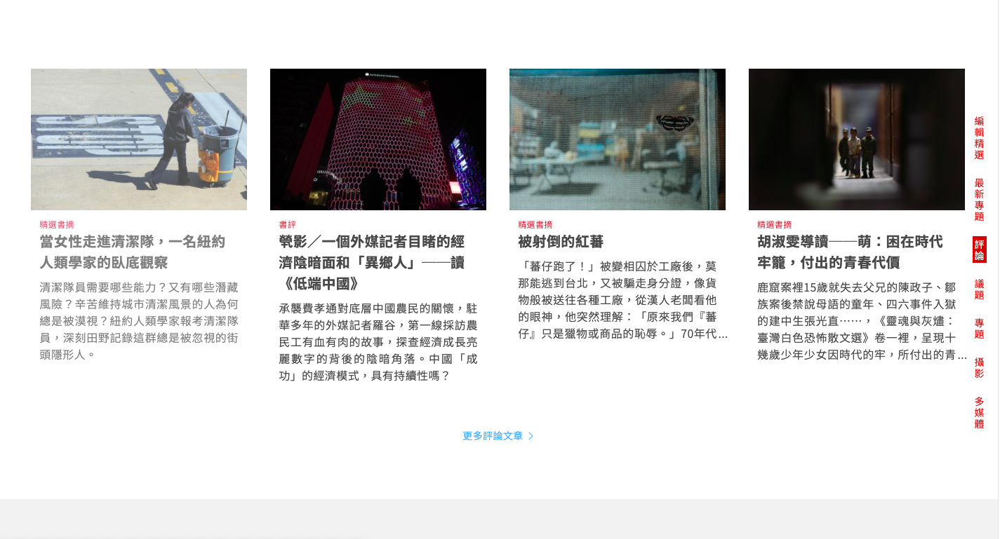
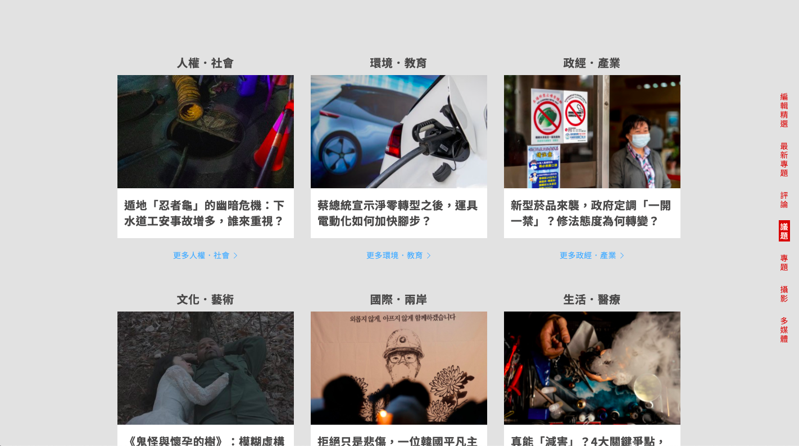
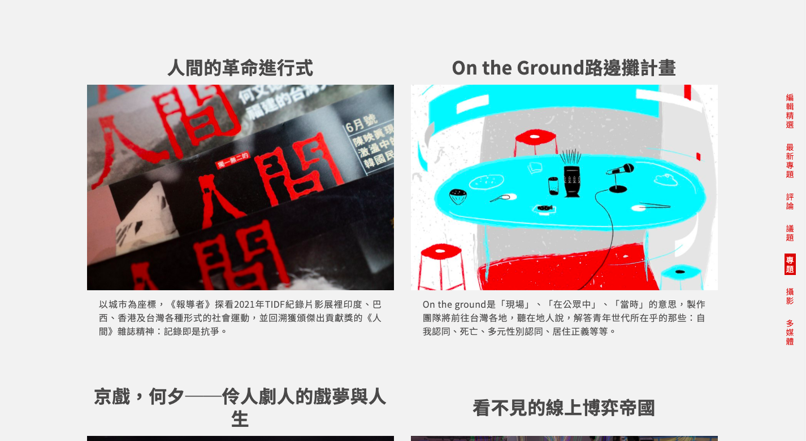
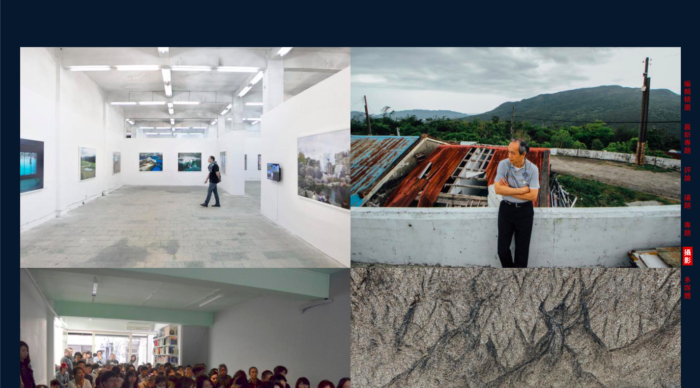

# 測試 index-page

## 測試項目

- [ ] 共同測試項目
- [ ] 根據[桌機測試項目](#桌機測試項目)測試

## 共同測試項目

- [ ] 測試「贊助我們」按鈕

  - [ ] 點擊「用行動支持報導者」之「贊助我們」按鈕，會另開網頁且連結為
        'https://support.twreporter.org/?utm_source=www.twreporter.org&utm_medium=index&utm_campaign=%2F'

- [ ] 測試電子報訂閱按鈕

  - [ ] 輸入 email 並點擊「訂閱」按鈕，會另開網頁且連結為 'https://twreporter.us14.list-manage.com/subscribe/post?u=4da5a7d3b98dbc9fdad009e7e&id=e0eb0c8c32'

- [ ] 測試 Podcast 區塊 「立即收聽」按鈕
  - 點擊「立即收聽」，會另開網頁且連結為 'https://www.twreporter.org/a/podcast-list?utm_source=www.twreporter.org&utm_medium=index'

## 桌機測試項目

- [ ] 測試 anchor
  - [ ] 分別點擊側欄的「編輯精選」、「最新專題」、「評論」、「議題」、「專題」、「攝影」、「多媒體」錨點，確定能滾動到對應區塊
    - 各對應區塊示意圖如下
      - 編輯精選：
      - 最新專題：
      - 評論：
      - 議題：
      - 專題：
      - 攝影：
      - 多媒體：
